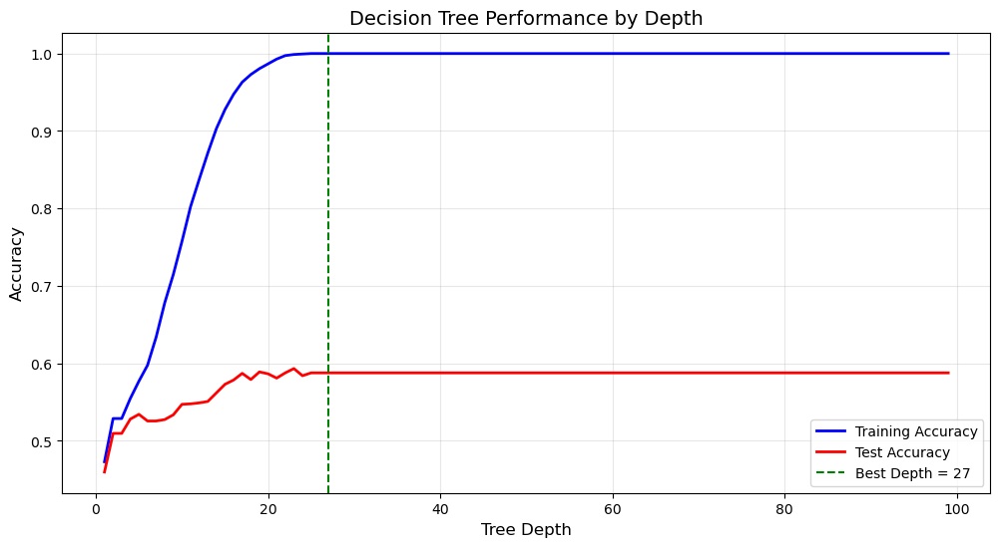
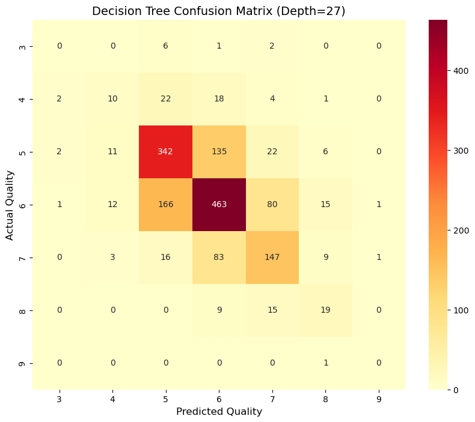
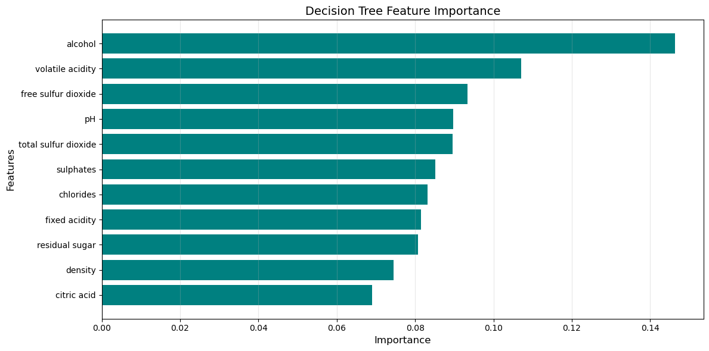
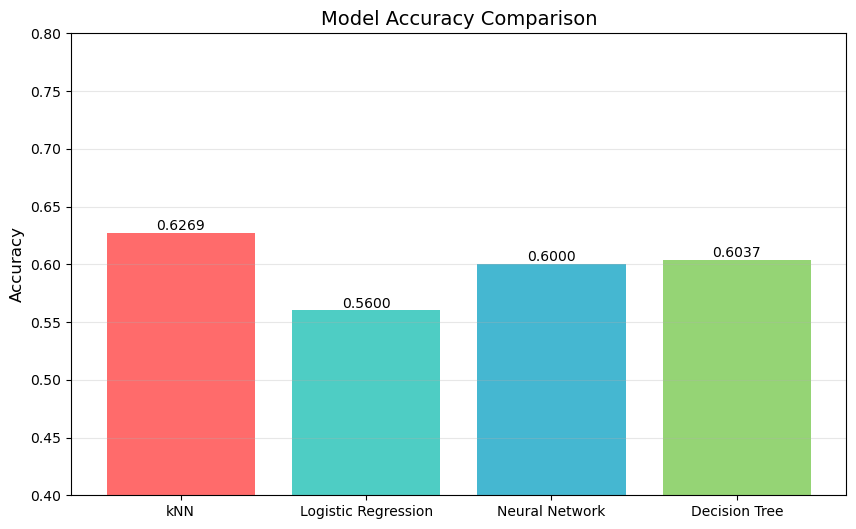

## Exploratory Data Analysis & Visualizations

### 1. Wine Quality & Type Distributions

* **Overall Distribution (Left):** Severe class imbalance across the dataset, with sample counts heavily concentrated around ratings 5 and 6, while extreme quality scores (3, 4, 8, and 9) are sparse.
* **Quality by Wine Type (Right):** White wine samples dominate total volume, with both red and white varieties peaking at quality scores 5 and 6.

---

### 2. Decision Tree Complexity & Confusion Matrix Analysis

| Decision Tree Complexity (Depth vs. Accuracy) | Confusion Matrix Analysis |
| :---: | :---: |
|  |  |

* **Decision Tree Complexity (Depth vs. Accuracy):**
  * **Overfitting Dynamics:** As tree depth increases beyond 15, training accuracy rapidly approaches 1.0 (100%), while test accuracy plateaus near 0.59.
  * **Empirical Optimum:** Test performance peaks at **depth = 27** before leveling off, illustrating how unrestricted tree depth memorizes training instances without yielding generalization gains.
* **Confusion Matrix Analysis ($\text{Depth} = 27$):**
  * **Modal Concentration:** The vast majority of correct classifications land on quality scores 5 (342 correct) and 6 (463 correct) along the primary diagonal.
  * **Adjacent Error Profile:** Misclassifications are predominantly concentrated directly off-diagonal between adjacent classes (e.g., 135 samples of class 5 misclassified as 6, and 166 samples of class 6 misclassified as 5).
  * **Severe Boundary Failure:** Extremely rare classes suffer from severe recall degradation; class 3 and class 9 yield 0 correct predictions, reflecting the impact of extreme class imbalance.

---

### 3. Decision Tree Feature Importance

* **Primary Predictors:** **Alcohol** is the dominant indicator of wine quality ($\approx 0.146$ importance score), followed by **volatile acidity** ($\approx 0.107$) and **free sulfur dioxide** ($\approx 0.093$).
* **Secondary Chemical Factors:** Properties such as pH, total sulfur dioxide, sulphates, chlorides, and fixed acidity contribute moderately ($\approx 0.080\text{–}0.090$).
* **Lowest Contributing Features:** Density and citric acid contribute least to tree split criteria ($\le 0.075$).

---

### 4. Model Accuracy Comparison

* **$k$-Nearest Neighbors ($k\text{NN}$):** Achieved the highest overall benchmark accuracy at **0.6269**, benefiting from local non-parametric neighborhood boundaries.
* **Decision Tree:** Reached **0.6037** test accuracy, outperforming linear models while enabling direct feature attribution.
* **Neural Network (MLP):** Scored **0.6000**, capturing nonlinear relationships but constrained by tabular dataset size.
* **Logistic Regression:** Scored **0.5600**, serving as the lowest-performing baseline due to linear boundary constraints on multiclass physicochemical space.

echo "" >> README.md
