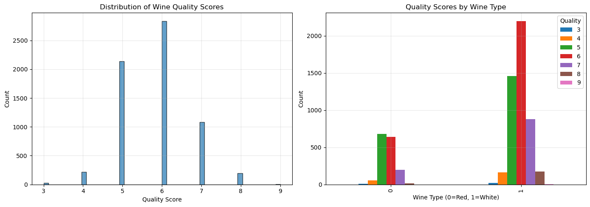

# Multiclass Wine Quality Classification & Diagnostic Analysis

An empirical machine learning study developed for **CS 178 (Machine Learning)** at UC Irvine, evaluating distance-based, linear, nonlinear, and tree-based models on multiclass physicochemical wine data.

---

## Problem Formulation & Dataset

* **Objective:** Predict discrete wine quality ratings (ranging from 3 to 9) using measured chemical attributes.
* **Dataset:** Combined red (1,599 samples) and white (4,898 samples) wine datasets totaling **6,497 samples** across 11 physicochemical features.
* **Task Type:** Multiclass classification.
* **Class Imbalance:** Most samples concentrate around ratings 5 and 6, while extreme ratings (3, 4, 8, 9) are sparse.

---

## Exploratory Data Analysis & Visualizations

### 1. Wine Quality & Type Distributions

* **Overall Distribution (Left):** Severe class imbalance across the dataset, with sample counts heavily concentrated around ratings 5 and 6, while extreme quality scores (3, 4, 8, and 9) are sparse.
* **Quality by Wine Type (Right):** White wine samples dominate total volume, with both red and white varieties peaking at quality scores 5 and 6.

---

### 2. Model Diagnostics & Error Analysis

| Decision Tree Complexity (Depth vs. Accuracy) | Confusion Matrix Analysis |
| :---: | :---: |
|  |  |

---

## Classifiers & Hyperparameter Optimization

Models were implemented in Python using **scikit-learn**, scaled with `StandardScaler` (fit strictly on training data), and evaluated using an 80/20 stratified train/test split.

| Model | Model Class | Search Space | Optimal Setup |
| :--- | :--- | :--- | :--- |
| **$k$-Nearest Neighbors ($k\text{NN}$)** | Instance-based | $k \in \{1, 3, 5, \dots, 29\}$, `weights='uniform'` | $k = 1$ |
| **Logistic Regression** | Linear baseline | $C \in \{0.001, 0.01, 0.1, 1, 10, 100\}$, `max_iter=1000` | Tuned via 5-fold CV |
| **Neural Network (MLP)** | Feedforward MLP | Topologies: `(50,)`, `(100,)`, `(50,25)`, `(100,50)`, `(100,50,25)` ReLU, Adam, $\alpha=0.001$ | Tuned via 5-fold CV |
| **Decision Tree** | Space partitioning | `max_depth` $\in \{3, 5, \dots, 20, \text{None}\}$ `min_samples_split`, `min_samples_leaf`, `max_features` | Grid search tuned |

---

## Experimental Results

Final model performance evaluated on the held-out 20% test partition:

| Model | CV Accuracy | Test Accuracy | Summary & Diagnostic Notes |
| :--- | :---: | :---: | :--- |
| **$k\text{NN}$** | **0.5948** | **0.6477** | **Best overall performer.** Weighted precision, recall, and F1 $\approx 0.65$. |
| **Decision Tree** | 0.5896 | 0.6162 | Strong overfitting: 0.9894 train accuracy vs. 0.6162 test accuracy. |
| **Neural Network** | 0.5605 | 0.5692 | Weighted F1 $\approx 0.53$; outperformed linear model, constrained by sample size. |
| **Logistic Regression** | 0.5417 | 0.5308 | Linear baseline; weighted F1 $\approx 0.48$. |

---

## Key Engineering & Scientific Insights

* **Accuracy Obscures Per-Class Failure:** While overall test accuracies reached up to $\approx 65\%$, confusion matrices proved that models predominantly succeeded on modal classes (5 and 6) and struggled heavily on boundary classes (3, 4, 8, 9) due to extreme class imbalance.
* **Adjacent Error Concentration:** Errors primarily occurred between neighboring ratings (e.g., misclassifying 5 as 6, or 6 as 7), indicating continuous underlying chemical traits that make strict discrete boundaries difficult to separate.
* **Top Predictive Features:** Feature importance analysis from the Decision Tree identified **alcohol**, **volatile acidity**, and **free sulfur dioxide** as the most influential predictors of wine quality.
* **Flexibility vs. Overfitting:** Flexible, non-linear classifiers consistently outperformed the linear baseline, but models like Decision Trees required strict regularization to prevent complete memorization of training instances.

---

## Authors & Team Contributions

* **Leo Lin:** Implemented and tuned classifiers ($k\text{NN}$ and Logistic Regression), conducted cross-validation experiments, organized performance results, and authored the Classifiers & Experimental Results sections.
* **Natalie Yang:** Implemented Neural Network and Decision Tree experiments, analyzed overfitting dynamics, confusion matrices, and feature importance.
* **Anjali Janavi Alwar:** Handled dataset preprocessing, merging red/white corpora, exploratory data visualization, and authored the Data Description.
* **Kelly Wu:** Compared evaluation metrics across models, interpreted error trends and confusion matrices, and compiled the final academic report.
